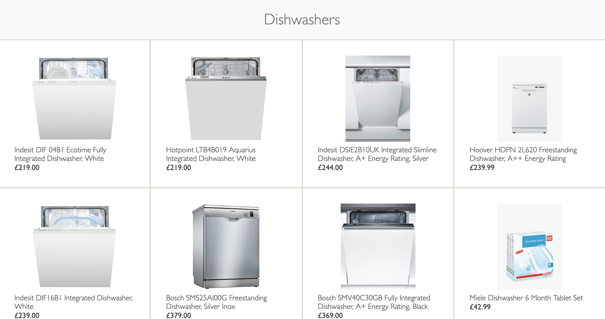
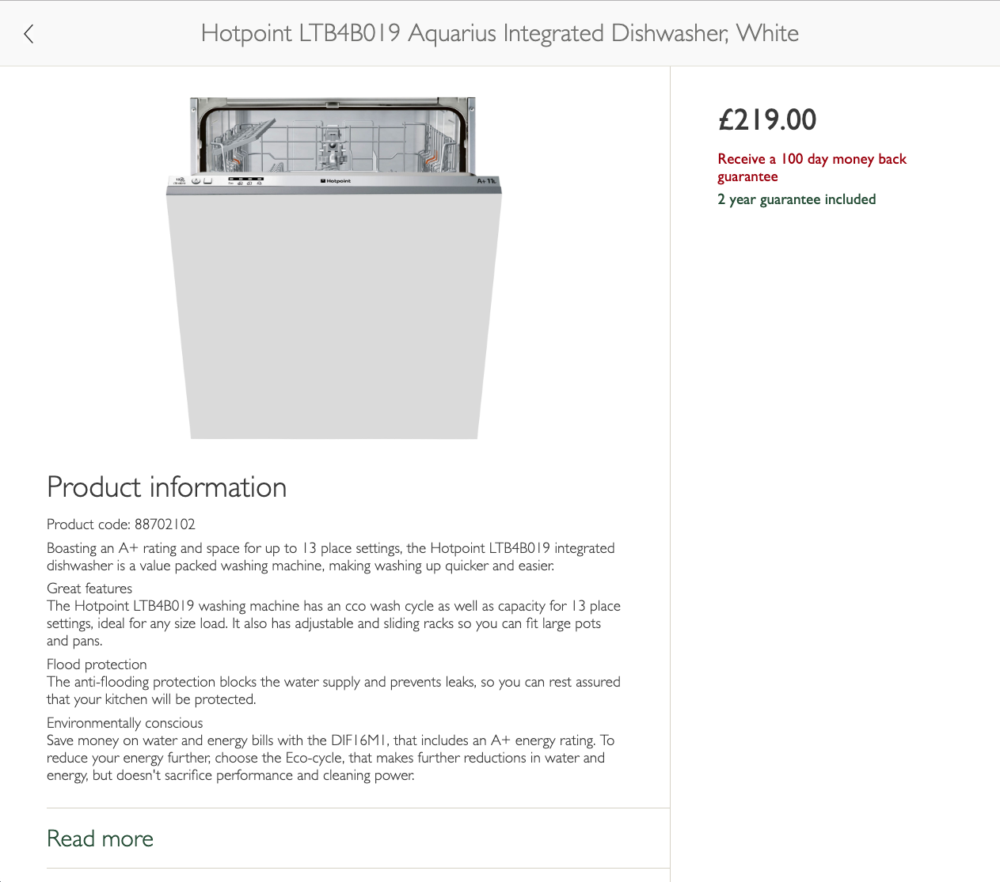
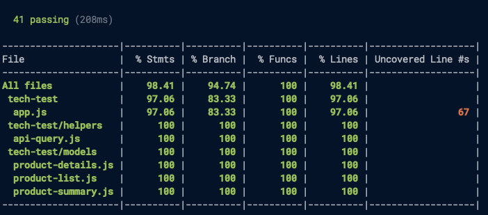

# John Lewis tech test

A website allowing users to see details of dishwashers sold by John Lewis, using data from the John Lewis API.

### Product grid

### Product details

## Installation

1. Clone repo
2. Run `npm install` to install dependencies
3. Run `npm start` to start the server
4. Navigate to <localhost:3000/dishwashers>

## Testing + test coverage

After installing execute `npm test` to run the tests and check test coverage.

## Approach

I started by writing feature tests to check that the '/dishwashers' route exists, and that it returns a page containing the correct information, which I passed by hard coding the information into the view. I then extracted a product summary model and a product list model using unit tests to drive the development. I used Nock to mock the API requests in my tests, loading in saved response data from a file.

The product summary class provides an interface for interacting with the API response data, and means that if the API data changes at any point only the product summary class will have to change, not the business logic.

I developed the product details page at '/product/:productId' using a similar process.

I also extracted a [helper object to construct the apiQueries](helpers/api-query.js). This allowed me to remove knowledge of the API details from the controller.

### Outstanding issues

- I didn't implement the landscape versions of the pages. I would have done this using CSS media queries to target viewports of the appropriate dimensions.
- I didn't implement the image carousel which is implied by the designs for the product details page. There are various approaches I could have used to implement this - plain JavaScript adding and removing "display" and "hidden" classes to particular images, with CSS rules to show and hide as appropriate; or use a JavaScript library like jQuery or React. In a business context I'd be looking to use whatever library is already in use on the site.
- I should have unit tested the views!

### Problems accessing the API

When making API requests from my Node app, sometimes the API would send me the data, and sometimes it would send me [this error message](api-bad-response.html) instead. The problem was intermittent, and didn't seem to be related to any changes I was making.

I couldn't work out how to fix this, so I wrote [this workaround helper function](helpers/api-workaround.js) which checks to see if the data was returned, and if not reads some data from a json file instead. The data in the json files is real data downloaded from the API. I didn't test this function, and it's excluded from the test coverage calculations.

This means that if the API isn't returning data when you run the app then only the product details pages where I saved the data will work. The first four grid items should be OK. The helper function will output to the server log whether the API returned the data or not.

## Technology used

- Node.js
- Express
- Request for making http requests in my app
- Express-Handlebars for views
- ESLint for linting
- Mocha for testing
- Chai assertion library
- Supertest for making http requests in my tests
- Cheerio for parsing http responses in my tests
- Nock for mocking the API requests in my tests
- nyc/Istanbul for test coverage
